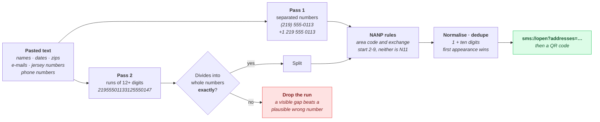
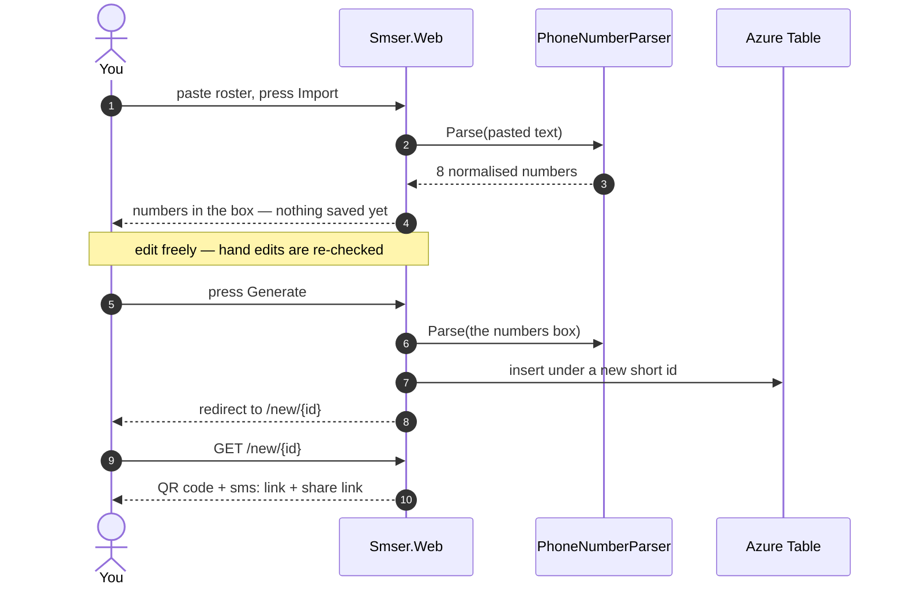
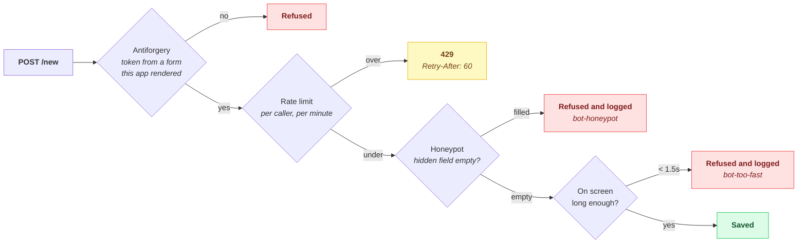

<div align="center">

# 📱 SMSer

### Group texts, easier.

Paste a roster — however garbled it came off your phone — and get back a link and a
QR code that open a group message with everyone already in it.

[](https://github.com/nhudacin/smser/actions/workflows/ci.yml)
[](https://dotnet.microsoft.com/)
[](https://learn.microsoft.com/dotnet/aspire/)
[](https://learn.microsoft.com/azure/storage/tables/)
[](LICENSE)

[Quick start](#-quick-start) · [How it works](#-how-the-parser-works) · [Architecture](#%EF%B8%8F-architecture) · [Samples](samples/) · [Testing](#-testing) · [Contributing](CONTRIBUTING.md)


</div>

---

## 🤔 Why

You coach a team, run a carpool, or organise a group of parents. You have everyone's
number — on a printed sheet, in a screenshot, in a forwarded email, or scattered through
your phone's contacts. You want one group text.

Getting there means typing thirty numbers into the To: field without a typo. Your phone's
"copy as text" gives you something like this:

```text
#7    Sam Chen         312-555-0147
#12   Alex Rivera      219-555-0113
Practice Tue/Thu 6:00pm, Field 3, Gate 12
```

SMSer takes that, finds the phone numbers in it, ignores the jersey numbers and the gate
number and the time, and hands back a QR code. Scan it, and the messaging app opens with
the whole roster already filled in.

## ✨ Features

| | |
|---|---|
| **📷 Photo import** | Take a picture of the roster, or drop one in. The text is read **on your device** — the photo is never uploaded. |
| **Paste anything** | Names, jersey numbers, dates, zips, e-mail addresses, OCR noise. The importer finds the phone numbers and ignores the rest. |
| **Every format** | `(219) 555-0113`, `219.555.0113`, `+1 219 555 0113`, `12195550113`, and a dozen more all collapse to one entry. |
| **Refuses to guess** | Numbers are checked against real NANP rules. A run of digits is only split when it divides into whole numbers *exactly* — a wrong number here gets texted to a stranger. |
| **QR code or link** | Scan the code, or tap the mobile link. Both open a group message with everyone in the To: field. |
| **Shareable, editable** | Every list gets its own short URL. Come back next season, fix a number, regenerate — the link stays the same. |
| **Works without JavaScript** | Import and Generate are real form posts. The only script on the page is the copy-link button. |
| **Light and dark** | Light by default for everyone; dark is a switch in the header that remembers your choice. Sized for the phone you are actually holding at the game. |
| **Locked down** | Strict CSP with no `unsafe-inline`, layered bot protection, per-caller rate limits, security headers, and no sign-in to leak. |

## 📸 Screenshots

<table>
<tr>
<td width="50%" valign="top">

**The front page**


</td>
<td width="50%" valign="top">

**Paste the mess, press Import**


Eight numbers found across six lines — two on one line, a duplicate collapsed, an
extension dropped, an order number and a zip ignored.

</td>
</tr>
<tr>
<td valign="top">

**Photograph the roster**


On a phone the camera button opens the rear camera directly. OCR runs on the device.

</td>
<td valign="top">

**Reading it**


</td>
</tr>
<tr>
<td valign="top">

**Dark mode, same page**


The QR keeps its white plate in dark mode — inverting it would make it unreadable to
every camera.

</td>
<td valign="top">

**On the phone it is used from**


</td>
</tr>
</table>

## 📷 Reading a photo

Take a picture of the roster — or on a desktop, drop one in or just paste it — and the text
goes straight into the import box, which then runs the same parser everything else does.

**The OCR runs in your browser**, on a WebAssembly build of Tesseract served from this
app's own origin. That is a deliberate choice, not a convenience one. A photo of a roster
is a photo of thirty people's phone numbers; the usual approach — POST it to a cloud
vision API — hands exactly that to a third party for every list anyone ever makes. Keeping
it on the device also means the feature works offline, costs nothing to run, and needs no
API key to try locally.

The trade is size: the engine is about 5 MB. It is fetched **on first use**, not on page
load, so anyone who never touches the photo control never downloads it, and the browser
caches it afterwards.

| | |
|---|---|
| **On a phone** | The camera button opens the rear camera directly (`capture="environment"`). |
| **On a desktop** | Drag a photo onto the drop zone, pick one, or paste one from the clipboard. The camera button is hidden, because `capture` does nothing there. |
| **Pasting a photo** | Works anywhere on the page — a screenshot never has to be saved to disk first. A paste carrying text is left alone, so pasting the roster *as text* into the import box still does what it always did. |
| **Before recognition** | The image is scaled to 2000px on its long edge and EXIF rotation is applied, so a portrait phone photo does not reach the OCR sideways. |
| **After** | The text is *appended* to the import box and Import runs automatically — photographing page two does not wipe page one. |
| **Without JavaScript** | The whole control stays hidden. Pasting still works. |

OCR output is messy by nature, which suits this app: the parser was already built to find
numbers in garbled text and ignore the rest. What comes out of a photo is exactly the kind
of input [`samples/`](samples/) is full of.

## 🧠 How the parser works

`PhoneNumberParser` is the app. It runs two passes over the pasted text, because the input
splits into two very different shapes.



**The all-or-nothing rule in pass 2 is the part worth understanding.** The obvious
implementation walks left to right and skips a digit when nothing fits. Given
`00721955501133125550147` — a roster line whose row number got glued to the front — that
version skips the two zeros, finds a structurally valid ten-digit window, and emits it. The
result is a real number that could belong to anyone, saved and then texted, and nothing
downstream can tell it apart from a number you meant. Requiring an exact tiling removes
that entire class of answer.

Scope is NANP only (US, Canada, Caribbean). A parser loose enough for arbitrary
international formats accepts most of the surrounding junk too.

## 🏗️ Architecture


The parser, the link builder, the ids and the storage contract all live in
`Smser.Library`, which takes no ASP.NET dependency — so the roster round-trip is testable
without a host, and a future worker or CLI can reference the same code.

Two projects sit alongside and are left off the diagram because they wire things up rather
than serve requests: **`Smser.AppHost`** is the .NET Aspire host that starts Azurite and
the web app together for local development, and **`Smser.ServiceDefaults`** carries the
OpenTelemetry setup, the health checks behind `/alive` and `/version`, and the
Content-Security-Policy.

### What a paste actually does



## 🚀 Quick start

### Prerequisites

| | Why | Check |
|---|---|---|
| [.NET 10 SDK](https://dotnet.microsoft.com/download/dotnet/10.0) | Everything. | `dotnet --version` → `10.0.x` |
| [Docker Desktop](https://www.docker.com/products/docker-desktop/) | The app host runs Azurite, the Azure Storage emulator, in a container. | `docker version` |

Docker is only needed for the app-host path — see [without Docker](#without-docker).

### Run it

```bash
git clone https://github.com/nhudacin/smser.git
cd smser

dotnet restore src/Smser.slnx
dotnet build   src/Smser.slnx
dotnet run --project src/Smser.AppHost
```

| | URL |
|---|---|
| 🌐 The site | <http://localhost:5200> |
| 📊 Aspire dashboard (logs, traces, health) | <http://localhost:15200> |

> The dashboard prints a login URL with a token on it in the console — follow that link
> rather than the bare address, or it will ask you for the token.

`Ctrl-C` stops the web app and the Azurite container together.

### Try it

1. Open <http://localhost:5200> and click **Start a new list**.
2. Give it a name.
3. Open [`samples/messy-mixed.txt`](samples/messy-mixed.txt) and paste it into **Roster import**.
4. Press **Import** — it should find eight numbers.
5. Press **Generate**. You land on `/new/{id}` with the QR code, and that URL is now a
   permanent link to the list.

[`samples/`](samples/) has ten more, covering phone contact dumps, forwarded email
threads, OCR runs with the separators lost, non-NANP numbers, things that only look like
numbers, and one list long enough to exceed what a QR code can hold.

### Without Docker

Run the web project on its own against a locally installed
[Azurite](https://learn.microsoft.com/azure/storage/common/storage-use-azurite):

```bash
npm install -g azurite
azurite                             # leave running in its own terminal
dotnet run --project src/Smser.Web  # in a second terminal
```

`appsettings.Development.json` points the storage client at `UseDevelopmentStorage=true`
for this path. Under the app host that value is overridden from the environment, so both
ways work without editing anything.

### Where the data goes

Rosters live in an Azure Table called `rosters`. Under the app host, Azurite keeps it in a
named Docker volume so saved links survive a restart. To start from an empty table:

```bash
docker volume rm smser-azurite
```

### Troubleshooting

| Symptom | Cause |
|---|---|
| `docker: error during connect` on startup | Docker Desktop is not running. |
| Site loads, saving a roster errors | Azurite is still starting. The app host waits for it, so this is mostly the standalone path — check the `azurite` terminal. |
| `dotnet test` says to use `--solution` | You passed the `.slnx` positionally. See [Testing](#-testing). |
| Port 5200 or 15200 already in use | Change `applicationUrl` in the relevant `Properties/launchSettings.json`. |
| Copy-link button does nothing | `navigator.clipboard` needs a secure context. It is hidden on plain-http origins that are not localhost — e.g. reaching your dev machine from a phone by LAN IP. |

## 🧪 Testing

```bash
dotnet test --solution src/Smser.slnx
```

`--solution` is required — tests run through Microsoft.Testing.Platform (opted in via
`global.json`), which wants the flag rather than a bare path.

| Suite | What it covers |
|---|---|
| `PhoneNumberParserTests` | Every format, numbers buried in prose, run-together digits, and a long list of things that must **not** parse. |
| `SampleRosterTests` | Every file in [`samples/`](samples/) against its `.expected` result, plus a guard that no sample yields a number outside the reserved range. |
| `NewPageFormWiringTests` | Boots the real app and asserts on rendered HTML — the form's `action` and the buttons' `formaction`. |
| `PhotoImportWiringTests` | That the photo control ships hidden, asks for the rear camera, every vendored asset is served, and the CSP still permits the engine to compile. |
| `VisitRecorderTests` | What the audit log records and — mostly — what it deliberately does not. |
| `ShortIdTests` · `SmsLinkTests` · `QrCodeGeneratorTests` | Id keyspace and validation, link format, QR rendering and its capacity ceiling. |

The whole suite is self-contained: nothing reaches storage, and the page-wiring tests boot
the web app in-process. **No Docker, no Azurite.** CI runs exactly this on every pull
request, in Release, with `-warnaserror`.

> **Why a test renders HTML.** Generate once silently re-ran the Import handler, because a
> bare `<form method="post">` posts to the current document URL — which after Import was
> `/new?handler=Import`. Nothing was saved and no QR appeared, and every unit test passed
> straight through it. `NewPageFormWiringTests` exists so that cannot happen twice.

## 📁 Project layout

| Path | Role |
|---|---|
| `src/Smser.AppHost` | .NET Aspire host. Starts Azurite and the web app together for local dev. |
| `src/Smser.Web` | The site. Razor Pages, QR generation, rate limiting. |
| `src/Smser.Library` | Parser, `sms:` link builder, short ids, Table Storage. No ASP.NET dependency. |
| `src/Smser.ServiceDefaults` | OpenTelemetry, health checks, `/alive`, `/version`, response security headers. |
| `src/Smser.Tests` | MSTest on Microsoft.Testing.Platform. |
| `src/Smser.Web/wwwroot/lib/tesseract` | Vendored OCR engine. See [its README](src/Smser.Web/wwwroot/lib/tesseract/README.md) for versions and why it is committed. |
| `src/Smser.Web/wwwroot/lib/bitter` | Vendored display face. Self-hosted for the same reason — see [its README](src/Smser.Web/wwwroot/lib/bitter/README.md). |
| `samples/` | Sample rosters, each checked against an expected result on every build. |
| `scripts/` | Operator scripts. `list-visits.ps1` reads the production visit log. |

**Stack:** .NET 10 · ASP.NET Core Razor Pages · .NET Aspire · Azure Table Storage ·
QRCoder · Tesseract (WebAssembly, in-browser) · Bitter (self-hosted) · MSTest ·
GitHub Actions.

## 🔒 Privacy and security

This is an app about other people's phone numbers, so a few things are deliberate:

- **A roster is only as private as its link.** There is no sign-in. Ids are 8 characters
  of a 36-character alphabet — 41.4 bits — and the endpoint is rate limited. That is what
  makes scanning for other people's lists impractical.
- **Every phone number in this repo is fictional.** All of them are in `555-0100`–`555-0199`,
  the block [NANPA reserves](https://nationalnanpa.com/) for fictional use, and
  `SampleRosterTests` fails the build if a sample ever yields one outside it.
- **Photos never leave the device.** The OCR engine is WebAssembly served from this
  origin and runs in the browser. No photo is uploaded, stored, or sent to a vision API.
- **Nothing is stored that does not need to be.** The QR code is regenerated per request
  rather than kept in storage. There are no third-party scripts, no cookies beyond the
  antiforgery token, and no trackers.
- **There is a visit log**, and it records IP addresses. It is first-party, written to
  the same storage account as the rosters, and used to understand usage — see
  [Usage log](#-usage-log) for exactly what it holds and how to read it.
- **Strict CSP with no `unsafe-inline`.** All styling is in `site.css` and all behaviour in
  `site.js`, so the policy is one the markup actually honours.
- **CI audits dependencies** for known advisories, transitive ones included, on every PR.

Found something? See [SECURITY.md](SECURITY.md).

### Keeping the bots off an open form

Saving a roster needs no sign-in, which makes it worth automating for anyone who wants to
fill the storage behind it. There is no captcha, on purpose: every captcha worth having is
a third-party script on the one page where the roster lives, which would undo the promise
two bullets above. So the guard is four cheap layers instead, in the order a request meets
them.



| | |
|---|---|
| **Three budgets, not one** | Per caller, per minute: **2 saves**, 10 imports, 30 reads. Rate limiting is endpoint metadata and a Razor Page is one endpoint for its GET and its POST, so a single number would have to be loose enough for the loosest thing the page does. Splitting them inside the policy is what lets the write be held to two while a share link opened by a household behind one address still works. |
| **The honeypot is not `type="hidden"`** | The bots worth catching skip hidden inputs, because that is where honeypots live. It is a real text input moved off screen by CSS — and taken out of the tab order and hidden from assistive tech, so nobody can land in it by accident. |
| **It is never rendered with a value** | If a password manager ever fills it in and the page echoed it back, that person could never submit the form again. Every retry starts clean. |
| **The timestamp is encrypted** | Otherwise anyone who worked out what the field is for could back-date it. It is also *carried through* an Import rather than re-minted, so the clock measures how long you have had the form — not how long since the last round trip. |
| **Unreadable timestamps pass** | Data protection keys do not survive a restart unless persisted. Failing closed would reject the next save from everyone holding an open page every time the app deploys. |
| **Refusals are logged** | As `bot-honeypot`, `bot-too-fast` and `throttled`, in the same visit log as everything else — so "is this actually happening" has an answer that is not the storage bill. |

None of these stops a bot written for this app specifically. The rate limit is what bounds
what such a bot can do, and the log is what makes it visible.

## 📊 Usage log

Every page view is written to a `visits` table in the same storage account as the rosters.

| Field | |
|---|---|
| `OccurredAt` | UTC timestamp |
| `Event` | `page`, `roster-viewed`, `roster-created`, `roster-updated`, `bot-honeypot`, `bot-too-fast`, `throttled` |
| `Path` | the URL requested, as typed |
| `RosterId` | the roster involved, normalised, when the path names one |
| `Ip` | caller address — the visitor's, because forwarded headers are configured |
| `UserAgent`, `Referer` | as sent by the browser |
| `Country` | only when a front end supplies a country header |
| `NumberCount` | roster size, on create and update |

**Not logged:** static assets, `/alive`, `/version`, `/health`, and ordinary POSTs. App
Service polls the health endpoint continuously and a page pulls a dozen files, so logging
everything would bury the real visits and bill per transaction for the privilege. A save
posts and then redirects, so counting both would double every roster — the save is
recorded once, explicitly, as `roster-created`.

The POSTs that *are* recorded are the ones that went wrong: a submission refused as a bot,
and a caller turned away by the rate limiter. Throttled callers have to be logged from
inside the limiter, because the visit middleware deliberately sits behind it — so a flood
is not also a logged flood, and would otherwise leave no trace at all.

**It never slows a page down.** The request thread drops an entry into a bounded in-memory
queue and returns; a background writer batches them to storage every few seconds. If
storage is unavailable the batch is lost and the site carries on — analytics must not be
able to take the app down.

### Reading it

```powershell
az login
.\scripts\list-visits.ps1                                  # last 100, newest first
.\scripts\list-visits.ps1 -Count 20 -Event roster-created   # just the rosters created
.\scripts\list-visits.ps1 -Count 500 -Raw | Group-Object Ip | Sort-Object Count -Descending
```

It prints a table plus totals by event and a unique-IP count. `-Raw` gives objects for
grouping or `Export-Csv`.

### Retention

Nothing expires it yet. `VisitLog.DeleteBeforeAsync` deletes whole day-partitions and is
there for when something calls it — worth wiring up, since IP addresses are personal data
in most of the world and this is the only place the app holds any.

## 🗺️ Roadmap

- [ ] **Deploy to Azure.** The hooks are in place — `/alive` for the health probe,
      `/version` (the commit SHA, from `dotnet publish -p:SourceRevisionId=<sha>`) so a
      smoke test can tell the new build from the one it replaces, HSTS and
      forwarded-headers config for running behind a reverse proxy, and an app host whose
      storage resource targets a real account when published. There is no infra or
      pipeline yet.
- [ ] **Retention.** Rosters and visit-log entries are both kept forever today.
      `CreatedTs` and `VisitLog.DeleteBeforeAsync` exist so a sweep has something to use.
- [ ] **Non-NANP numbers**, if anyone actually wants them.

## 🤝 Contributing

Issues and pull requests are welcome — see [CONTRIBUTING.md](CONTRIBUTING.md). The short
version: `dotnet test --solution src/Smser.slnx` should pass, and any phone number you add
belongs in `555-0100`–`555-0199`.

## 📄 License

[MIT](LICENSE) © Nick Hudacin
